# Production brief — foundation rebuild

**Status:** design-first pass for a foundation rebuild of Edify's production side. Scoping captured in [/Users/nina/.cursor/plans/production-scoping-map_d9688d88.plan.md](../../.cursor/plans/production-scoping-map_d9688d88.plan.md) (`production-scoping-map`). The live-platform user-stories doc informs this brief as reference; it does not constrain the shape.

**First customer target:** Pret a Manger (hundreds of stores). The prototype shapes what Edify's next-generation production module becomes — not a feature bolted onto the current one.

> Read alongside [PROTOTYPE_CONTEXT.md](PROTOTYPE_CONTEXT.md) (focus area 7) and [DESIGN-PRINCIPLES.md](DESIGN-PRINCIPLES.md). Follow the "drafted → you approve" cadence.

---

## TL;DR

A production hub (`STANDALONE` / `HUB` / `SPOKE` / `HYBRID`) serves an estate on a rolling 5-day horizon. Quinn drafts the forecast, the plan, the board, AND the setup/config; humans approve. Every batch passes a **PCR** gate before it dispatches to sites as an internal transfer, which settles via a site-side GRN and reconciles against sales + waste.

Three goals above all else:

1. **Unify.** What today is split across hot-production, fixed-production (P1/P2/P3/P4), VP, and ad-hoc review UIs collapses into one spine with one mental model. "Hot production" as a separate thing goes away.
2. **Settings become conversation.** Today's config tree (bench rule engines, forecast-windows-per-category-per-site-per-production-per-day, cutoffs, tier assignments, selection-tag setup) is brittle and goes stale. Tomorrow: Quinn interviews on setup, detects drift, proposes updates from observation. Chat-style where it fits; dashboards where they fit.
3. **Scale-shaped data model.** Pret-scale (hundreds of sites, multiple formats) means estate → region → format → site inheritance, templates, bulk operations with propagation preview, and audit trails are first-class — not bolt-ons.

**Slice C builds the planning board + PCR gate + Quinn settings stub** — the smallest proof of the foundation. Everything else extends from there.

---

## Design goals

These guide every decision below.

1. **One spine, one UI shape.** No separate hot/fixed/VP UIs. Production is production; mode is an attribute.
2. **Settings as conversation, not configuration.** Interview-on-events, observation-driven proposals, stale-surfacing. Manual form editing is the escape hatch, not the primary surface.
3. **Quinn replaces tuning knobs.** Bench rule engines, selection-tag scheduling logic, P1→P2 overflow, forecast-window trees — all collapse into a Quinn-drafted plan you adjust. Knobs remain as overrides, not as the primary interface.
4. **Scale-first.** Estate → region → format → site inheritance. Bulk operations with propagation preview. Audit on anything that touches many sites.
5. **Settings stay alive.** Every setting shows last-updated / last-used. Stale settings are surfaced, not silently present.
6. **Reliability.** Clear state, trustworthy undo, no silent data inconsistencies, audit trails on propagation.

---

## Design principles this feature applies

Canonical reference: [DESIGN-PRINCIPLES.md](DESIGN-PRINCIPLES.md). Production surfaces are used on the kitchen floor with floury hands on a mounted tablet, mid-service — the principles matter more here, not less. Every surface below must honour these actively (not just link to them):

- **Fewer clicks, less thinking.** Every surface opens with Quinn's draft pre-populated. Users confirm or adjust; they never fill from blank. The 30-second test applies: could a harried manager complete this without looking up from their tablet?
- **Conversational over transactional.** Settings come out of a chat, not a form tree. One question at a time, tappable options (not typed inputs), Quinn narrates. Structured data is built up through conversation.
- **Status always visible.** Every batch block, spoke submission, PCR, carry-over item, and stale-settings card carries a status pill (`green = complete / reviewed`, `amber = needs attention`, `red = failed / dispute`). The board shows completion % per bench per day at a glance.
- **Surface the right things, hide the rest.** Setup-time complexity (batch-rule tuning, cutoff configuration, selection-tag edits) lives in the settings-conversation surfaces — never clutters the daily-ops board.
- **Errors handled gracefully.** Batch-rule collision → Quinn surfaces the binding rule + offers split-or-hold. Missed cutoff → offer unlock-with-reason. PCR fail → one-tap routes through waste log to a new remake batch. Transfer variance → two clear paths (accept as one-off / flag for hub follow-up), per the principle's "update system-wide vs. accept this time" shape.
- **Consistent, learnable patterns.** Reuse existing pills, +/− steppers, pill multi-select, success banners, and status colours. Don't invent new interaction shapes — a user who knows the invoice-matching or GRN flow should recognise the production flows.
- **Respect the environment.** Board blocks have ≥ 40×40px tap targets. Bold typography for quantities and times. +/− steppers for any numeric adjust. Mobile collapses the board to per-bench cards that work one-handed; desktop shows the full grid for planning sessions.

**UX notes applied per surface:**

- **Kitchen board.** Status pill per block (`planned / in-progress / complete / failed / reviewed / dispatched`); bold numbers; tap-to-focus for a batch opens a stepper-shaped detail view; mobile = card-per-bench, desktop = full grid.
- **Carry-over sheet.** Quinn's draft is the default answer. One-tap "accept all"; per-line override with +/− stepper. Green success banner + summary on confirm ("Tomorrow's plan adjusted for 3 recipes").
- **PCR gate.** Tap-to-confirm each quality / label check, never type. Checklist pattern reused from [app/checklists/](app/checklists/). Progress % on the bench tile; green success banner at bench-review submission.
- **SPOKE submission.** Cutoff rendered as a countdown status pill (`4h 20m — on track` / `cutoff passed`). Quinn-drafted selection pre-filled from recent history; one-tap confirm. No blank form.
- **Quinn setup chat.** One question at a time, tappable options, sensible template default pre-selected. Narrates next step. Summary card at the end ("Here's what we saved"), matching the invoice-matching confirmation shape.
- **Settings health dashboard.** Each stale item is a card with a status pill (`stale 90+ days / unused / suspect`). Sorted by impact. One-tap remediation (archive / refresh / edit) from the card — no drill-down-and-return.
- **Batch-rule tooltip.** Names the binding rule in plain language ("Oven holds max 12; this recipe caps at 8. Effective max: 8."). No error codes.

---

## Mental model

### Entities (V1)

- **Site** — `{ id, type: 'STANDALONE' | 'HUB' | 'SPOKE' | 'HYBRID', estateId, format? }`. SPOKE sites submit to a HUB with cutoffs; HYBRID sites produce in-house AND receive from a hub. One model, four role-shapes.
- **Estate / Format** — top-of-hierarchy shapes for cascading settings (e.g. `format-airport`, `format-corner`).
- **Recipe** — canonical "how it's made". Pre-existing in [app/recipes/](app/recipes/); source of truth.
- **AssemblyRecipe** — existing primitive in live Edify: a recipe composed of sub-recipes, with `quantityPerUnitOfAssembly = ingredientQuantity / recipeYield`. Handles the recipe-math side of composition. Nested assemblies unsupported.
- **Product** *(forward overlay — post-V1)* — richer than an AssemblyRecipe: a sellable SKU wrapping one or more Assembly/Recipes with its own workflow, PCR shape, and hub-side orchestration. Assembly handles math; Product handles operational wrapping. **V1: skip — SKU attaches 1:1 to Recipe or AssemblyRecipe.**
- **ProductionItem** — `{ skuId, recipeId | assemblyId, batchSize, shelfLife, mode, workflow, batchRules? }`. Unified across what live Edify today calls fixed + hot production.
- **ProductionMode** — `'run' | 'variable' | 'increment'`. Per-SKU.
- **ProductionWorkflow** — a DAG of stages: `{ stages, deps }`. Stage: `{ id, capability, leadOffset, optional?, parallelGroup? }`. `leadOffset` up to **D-2** for V1.
- **Bench** — unified with live Edify's "Station". `{ capabilities, availabilitySlots, batchRules? }`. Lives at one hub or hybrid site.
- **BatchRules** — `{ min, max, multipleOf }`. Set at **bench** or **recipe** level. Recipe wins.
- **SelectionTag** — `'breakfast' | 'morning' | 'opening' | 'closing' | 'flexible' | 'must-stock'`. Tag on recipe-within-tier; informs Quinn's scheduling. Replaces live Edify's hard-coded tag logic with Quinn-drafted softer behaviour that still respects intent.
- **Assortment** — unified shape for **Range** (estate-level SKU grouping with temporal rules) and **Tier** (site-level day-of-week rule assigning one-or-more ranges). Tiers can stack (additive union).
- **SiteTierAssignment** — `{ siteId, tierId, daysOfWeek[] }`.
- **DemandForecast** — per-site × per-SKU × per-day qty, gated by active tier. Drivers: sales, weather, stock, orders, waste, events, promos.
- **ProductionPlan** → **PlannedInstance** → **ProductionBatch** → **PCR** → **TransferManifest** → **TransferGRN** → **ReconciliationRecord**.
- **CarryOver** — yesterday's unsold reduces today's planned quantities. Recipe-level `allowCarryOver`. Processed in production-order. Quinn drafts; Manager confirms.
- **Duty** — non-recipe bench task (setup, cleanup). Assigned to benches; `assignToAllBenches` option.
- **PCRRecord** — `{ batchId, type: 'batch' | 'on-demand' | 'preparation' | 'repackaging', qualityCheck, labelCheck, signedBy, signedAt }`. Ad-hoc types reuse the PCR shape for work outside the planned production.
- **Roles (V1)** — `Manager` and `Staff`. Managers plan, approve, adjust, propagate. Staff log batches, tick stages, and sign PCRs (per live Edify: all roles can submit reviews). Richer split deferred.

### Naming changes from live Edify

| Live Edify | This prototype | Why |
|---|---|---|
| Hot Production | (removed) — rolled into `increment` mode | One spine |
| Fixed Production (P1…P4) | `run` mode with `RunSlot[]` | Slots replace named productions |
| Variable Production (VP) | `variable` mode | One spine |
| Station | Bench | Unified workstation |
| Production Control Review | PCR gate (same shape) | Already aligned |
| `isFullSelectionTime` buffer | Quinn-drafted buffer from demand + assortment | Knob → Quinn's job |
| Bench allocation rule engine (priority-weighted rules: Same-Key-Ingredients / Same-Category / Priority-Not-Made / Fixed-Order / AI-prompt) | Quinn draft + manager overrides | Rule engine → Quinn's job |

Users still configure specifics (slot times, batch rules, selection tags, cutoffs). But the settings come out of a **conversation with Quinn**, not a form tree.

---

## The spine

```mermaid
flowchart LR
    Assortment["Range / Tier<br/>(site × day, selection tags)"] --> Forecast["DemandForecast<br/>5-day, drivers visible"]
    Forecast --> Plan["ProductionPlan<br/>mode: run / variable / increment"]
    Plan --> Carry["Carry-over adjust<br/>(Quinn-drafted)"]
    Carry --> Expand["Workflow expand<br/>lead-offsets land prep days earlier"]
    Expand --> Board["Kitchen board<br/>time x bench (unified)"]
    Board --> Batch["ProductionBatch"]
    Batch --> PCR["PCR gate<br/>Staff or Manager signs"]
    PCR -->|pass| Manifest["TransferManifest"]
    PCR -->|fail| Waste["Waste log<br/>remake = new batch"]
    Manifest --> SpokeFlow["SPOKE submission + cutoffs"]
    SpokeFlow --> GRN["Site TransferGRN<br/>open variance if mismatch"]
    GRN --> Recon["ReconciliationRecord<br/>sent / received / sold / waste"]
    Recon --> Carry
```

End-to-end one flow. Carry-over closes back to tomorrow's plan. Ranges/tiers gate every downstream step.

---

## Production modes (unified)

| Mode | What it is | When to use | Scheduling unit | Live Edify equivalent |
|---|---|---|---|---|
| `run` | Fixed slots (R1, R2, R3…) | Large batches, scheduled peaks | `RunSlot { startTime, durationEst, workflow }` | P1 / P2 / P3 / P4 |
| `variable` | On-demand; triggers: stock par / Quinn nudge / customer order / manual | Low-volume, bespoke, reactive | `VariableTrigger { reason, requestedBy, qty }` | VP (with its `adjustedForecast + closingRange - totalMade` math) |
| `increment` | Continuous small-batch at a repeating interval, shelf life tracked | Fresh-through-the-day, short shelf life | `IncrementCadence { interval, perIncrementQty, shelfLifeMinutes }` | Hot Production (Stations + timed batches) |

Mode is per-SKU. Quinn drafts the classification from history; Manager confirms. Increment interval: Quinn proposes from the demand curve; hub preset overrides.

**One board renders all three.** A `run` shows as a single block; a `variable` shows as a trigger-marker that materialises into a block when fired; an `increment` shows as a repeating cadence along its row. Tapping any block opens a focus view — replaces the live Edify "production stepper" for hot batches with a tap-to-zoom on the same board.

---

## Ranges, tiers, selection tags

- **Range** — estate-level SKU grouping with temporal rules (dates, days-of-week, timeslots).
- **Tier** — site-level rule assigning one or more ranges to a site per day-of-week. Tiers can stack (additive union; most-permissive timeslot wins unless explicit priority).
- **Selection tags** — lightweight recipe-within-tier tags (`breakfast / morning / opening / closing / flexible / must-stock`). Inform Quinn's scheduling. Replaces live Edify's hard-coded tag logic (P1→P2 overflow rule, closing-range inference) with softer, Quinn-drafted behaviour that still respects tag intent.
- **Intra-day availability** is a **hard gate** — no sell or produce outside the window. Granularity: per-hour / per-run / per-phase / custom, in any combination.
- **Range lifecycle is run-aligned**, not midnight-aligned.

**Menu framing.** Ranges + tiers + stacking + selection tags **are** the estate's menu system. Do not invent a parallel menu concept.

**Scale framing.** At Pret scale, an estate may have 500 sites across 4+ formats (flagship / corner / airport / campus). Tier-to-site assignment needs bulk operations ("set all airport sites to Tier-Transit on weekends") with propagation preview ("this changes the active range on 112 sites — review?").

---

## Batch rules

Every batch has an effective `{ min, max, multipleOf }`. The rule can live at **bench** level (hardware limit) and/or **recipe** level (recipe-specific constraint). **Recipe wins** when both exist.

Quinn uses the tightest-binding rule:
- demand > max → split into N batches automatically
- demand < min → flag as "too small to run — hold or combine?"
- board tooltip always names the binding rule

---

## The kitchen board (the net-new primitive)

**2D grid: benches (rows) × time-of-day (columns).** Each hub and each hybrid site gets its own board. One board renders run + variable + increment together.

Quinn drafts, human adjusts:
- explodes workflows backwards across days (respecting `leadOffset`, D-2 max)
- auto-allocates benches by capability, flagging conflicts with one-click shift-right / reassign nudges
- enforces batch rules (splits above max, flags below min)
- surfaces utilisation outliers (>90% overload, <30% slack)
- cascades edits — move a bake stage, cool + pack follow

Tap-to-focus: an increment row opens a step-through view for the team running that cadence; a run block opens batch detail / PCR entry. Deliberately replaces two live Edify surfaces (bench cards + production stepper) with one.

---

## PCR (production compliance review)

- **Per-batch**, not sample-based.
- **Signed by Staff or Manager** (per live Edify: all roles can submit reviews).
- Checks: `qualityCheck` + `labelCheck`. Label checklist is Manager-maintained (one central list, not per-item templates).
- **Ad-hoc PCR types** — same PCR shape applied to work outside the plan:
  - `on-demand` — unplanned batch (customer order, ad-hoc request). Full PCR; updates stock.
  - `preparation` — prep-ahead work (mise-en-place, dough prep) tracked separately from the batch it feeds. Full PCR; does NOT update stock.
  - `repackaging` — re-labelled/re-bagged existing items, with a reason (dirty-packaging / damaged-packaging / damaged-label / make-into-slims). Skips quality re-verification; does NOT update stock.
- **Fail → waste log** (tracked). Remake = new batch on the board, not in-place rework. One-click "create remake batch".

Pattern-match: PCR is a checklist-shaped surface. Reuse [app/checklists/](app/checklists/) primitives.

---

## Carry-over

Daily mechanic: **unsold items from yesterday reduce today's planned quantities**.

- Recipe-level `allowCarryOver` flag (perishables excluded).
- Processed in production-order (earliest `run` slots first).
- Changing quantities after bench allocation invalidates bench assignments — the board surfaces this cleanly, not silently.

**Quinn's job.** Quinn drafts tomorrow's carry-over adjustment from today's close-of-day data; Manager reviews and confirms. Replaces the "enter carry-over per recipe" chore with an approval step.

---

## Hub ↔ spoke coordination

- **SPOKE site** selects productions to receive from its HUB, with quantities per recipe.
- **Cutoffs** — per-production per-day-of-week deadlines. Cutoff day (usually the day before) sets lead time.
- **Hub unlock** — HUB manager can unlock a SPOKE past cutoff (`ignoreCutoff`). Post-unlock, spoke quantities are **added** to the hub's existing plan (not replaced). Unlock auto-resets after submission.
- **Hub modification** — HUB can modify spoke quantities with a **mandatory reason** (`isModifiedByHub`, `lastModifiedBy`, `modificationReason`). Audit-visible.
- **Transfer status** — `TRANSFERRED | DISCARDED` per spoke-selected production.
- **Spoke carry-over** feeds back into hub planning (aggregated by recipe across connected spokes).

**V1 in slice C:** stub the submission surface — one SPOKE submitting, one cutoff rendered, one unlock demo, one Quinn-drafted spoke selection ready to approve. Full modification-with-reason + spoke carry-over aggregation = slice D.

---

## Quinn across the spine

Quinn has two roles: **daily operator** and **settings maintainer**.

### Daily operator

| Stage | Quinn drafts | Human decides |
|---|---|---|
| Range / tier fit | Tier-swap suggestions from observed sales; SKUs under-/over-selling vs. range; selection-tag-aware scheduling | Manager approves swap; curates range contents |
| Forecast | Multi-day per-site qty + drivers, gated by active tier | Manager accepts / nudges / overrides |
| Carry-over | Drafts tomorrow's plan adjustment from today's close-of-day data | Manager confirms |
| Plan — mode split | Classifies SKU as run / variable / increment; proposes slot times + increment intervals from demand curve | Manager confirms mode; sets or overrides at hub level |
| Workflow expansion | Explodes workflow backwards; lands prep stages D-1 / D-2 | Manager adjusts lead times; skip / add stages |
| Bench allocation | Draft-assigns by capability + capacity; surfaces conflicts | Manager resolves / rebalances |
| Batch sizing | Respects effective batch rules (recipe wins); splits above max, flags below min | Manager overrides specific batches |
| Produce | Flags yield anomalies; fires variable triggers | Staff log qty + tick stages |
| PCR | Pre-fills qty; surfaces checklist | Staff or Manager signs; fail → waste, remake |
| Spoke submission | Drafts spoke selection from their recent history; flags cutoff risk | Spoke manager confirms + submits |
| Allocate | Splits PCR-passed output per forecast (pro-rata if short) | Manager approves / reallocates |
| Dispatch / Receive / Reconcile | Drafts manifests, flags variance (single open-variance flag in V1) | Manager confirms |

### Settings maintainer

| Moment | Quinn drafts | Human decides |
|---|---|---|
| New site onboarding | Interview: type, hours, format, ranges, tier, benches, hub/spoke relationship — with sensible template defaults | Manager confirms each answer |
| Estate change detected | "3 new airport sites opened this week. Apply the airport-format template?" | Manager confirms / adjusts |
| Drift detection | "Tier 'Winter' unused since March. Archive or update?" / "This bench hasn't been assigned a recipe in 60 days." | Manager archives / confirms / edits |
| Observation-driven proposal | "At site X, Sunday's plan is manually overridden every week. Update the Sunday default?" | Manager accepts / ignores |
| Change impact preview | "This range change affects 112 sites across 4 formats — review?" | Manager approves propagation or stages |
| Settings health | Periodic surface: stale ranges, unassigned benches, recipes never produced, PCR checklists > 90 days old | Manager triages |

This is the second load-bearing Quinn surface, alongside the planning board. Shipping both — even as stubs — is slice C's job.

---

## Settings as conversation

Today's setup in live Edify: admin walks a form tree — benches per site, hub/spoke relationships, supplier-hub assignments, cutoffs per production per day, `assignToSupplierHub` toggles, forecast windows per site-category-production-day, bench allocation rules with priority weights, selection tags per recipe per tier, cutoff day per production. Most of it goes stale; few people keep it current. This is the biggest current chore for the Pret-scale customer.

Tomorrow's setup — three intertwined patterns:

1. **Interview-on-events.** Quinn interviews when something real happens (new site opens, new range drafted, new format added). Natural-language questions, multiple-choice answers, human confirms. No empty forms to wander.
2. **Observation-driven proposals.** Quinn watches daily operations and proposes config updates from what it sees — "you override this every Tuesday; update the default?"
3. **Stale-setting surfacing.** Every setting is visibly dated. A periodic "settings health" dashboard shows what's stale / unused / suspect, sorted by impact.

**UI medium** — chat-style is the natural medium for (1) and (2); dashboard-style for (3). Chat isn't the only answer though — templates + inline editing in the surface a setting affects + progressive disclosure are all valid complementary patterns. Slice C demos the interview pattern and the health dashboard; the rest iterates.

**Slice C stub:** Quinn interview on "new site opens" scenario + a settings-health dashboard with 5 representative stale items (one unused tier, one site with no cutoff configured, one bench with no recipes in 60 days, one range 10 months stale, one recipe with no `closingRange`). Enough to pressure-test the UX; not enough to replace the whole config surface yet.

---

## Multi-site scale (Pret-shaped)

At hundreds of sites across formats, these become first-class:

- **Estate-level entities** with inheritance: `Estate → Region → Format → Site`. Settings cascade; overrides explicit.
- **Templates** — a "corner store" template, an "airport" template. Apply to many sites at once; diffs visible.
- **Bulk operations** with preview — "apply this range to all airport sites" shows count + impact before confirm.
- **Change propagation** — when an estate-level setting changes, surface affected sites. Stage changes if impact is big.
- **Audit trail** — who changed what, when, why. Mandatory reason on big propagations.
- **Format variants** — flagship / corner / airport / campus have different shapes (different benches, different hours, different ranges). Templates make this manageable.

V1 fixtures include **one estate, two formats** to pressure-test the pattern even at prototype scale.

---

## V1 scope — slice C

**Build.** Planning board + PCR gate + Quinn settings stub, across **one estate, four site types** (STANDALONE / HUB / SPOKE / HYBRID) and **two formats**, on a 5-day horizon.

**In scope:**
- Multi-day planner strip (D-2 … D+2)
- Unified kitchen board (run + variable + increment together; tap-to-focus for increment cadence)
- Three production modes with at least one SKU of each
- Workflow expansion with cross-day prep (one D-2 ferment, one D-1 prep)
- Bench + recipe batch rules with at least one "recipe wins" collision
- PCR gate, Staff OR Manager sign, fail → waste + remake path
- At least one `on-demand` ad-hoc PCR item demoed
- Range + tier with selection tags, 2 ranges, 2 tiers, ≥ 1 stacked tier-day, per-run + per-phase + custom window intra-day examples
- Carry-over entry (Quinn-drafted, Manager-confirmed)
- SPOKE submission stub (one spoke, one cutoff render, one unlock demo)
- Quinn settings-interview stub ("new site opens" flow)
- Settings-health dashboard with 5 representative stale items
- One AssemblyRecipe demo (e.g. Club Sandwich = bread + filling sub-recipes)
- Manager / Staff role split
- Quinn panels with "drafted → you approve" on every surface

**Out of scope for slice C (later slices):**
- Full forecast detail UI (drivers visible, not editable)
- Full transfer + GRN + reconcile (single open-variance flag on the stub)
- Parallel / branching workflows (V1 = linear + optional; DAG shape ready)
- Product overlay (V1 = SKU-on-recipe or SKU-on-assembly 1:1)
- Typed transfer variances
- Hub modification of spoke quantities with mandatory reason
- Full multi-estate / multi-tenant isolation
- Bulk-operation console (one bulk demo; full console later)
- Chat-driven setup for the richer config (bench rules, forecast windows, cutoffs end-to-end)
- Duties (non-recipe bench tasks) — deferrable to slice D
- Traceability codes, Macromatix integration, feature flags, permissions enforcement

---

## Proposed routes & components

Follows conventions in [app/](app/) and [components/](components/).

**Routes (new):**
- `/production` — estate-level landing; picks hub or shows summary
- `/production/board` — unified kitchen board (`hub`, `date`)
- `/production/plan` — multi-day planner strip (`hub`, `from`)
- `/production/batch/[id]` — batch detail + PCR gate
- `/production/carry-over` — end-of-day carry-over confirmation
- `/production/spoke` — SPOKE submission surface
- `/production/ranges`, `/production/tiers` — assortment management (read-mostly in V1)
- `/production/settings` — settings-health dashboard
- `/production/setup` — Quinn interview flow (new-site stub)

**Components (new, under `components/Production/`):**
- `KitchenBoard.tsx`, `BenchRow.tsx`, `BatchBlock.tsx`, `IncrementCadence.tsx`, `StageBlock.tsx`
- `PlanStrip.tsx`, `ModeBadge.tsx`, `BatchRuleTooltip.tsx`
- `PCRGate.tsx`, `AdHocPCRForm.tsx`
- `CarryOverSheet.tsx`
- `RangeTierIndicator.tsx`, `AssortmentPicker.tsx`, `SelectionTagChip.tsx`
- `SpokeSubmission.tsx`, `CutoffMarker.tsx`
- `QuinnProductionPanel.tsx` (daily-ops nudges, right-rail)
- `QuinnSetupChat.tsx` (interview flow)
- `SettingsHealthDashboard.tsx` (stale-setting surface)
- `fixtures.ts`

**Reuse:**
- PCR sign-off → [app/checklists/](app/checklists/) primitives
- Failed batch → [app/log-waste/](app/log-waste/) flow
- Transfer/GRN shape → mirror [app/invoices/](app/invoices/) and [app/purchase-orders/](app/purchase-orders/) when that slice lands
- Quinn chat pattern → align with existing briefing / nudge surfaces in [components/Feed/](components/Feed/)
- **Design tokens + interaction shapes** → do not rebuild. Pull from the established system per [DESIGN-PRINCIPLES.md](DESIGN-PRINCIPLES.md) Look & Feel Reference:
  - Status pills (`green / amber / red`) on every list item with state — same anatomy as invoice-matching, GRN, waste
  - `+/−` stepper for any numeric adjust (planned qty, batch size, increment cadence qty, carry-over override)
  - Pill multi-select for range/tier SKU curation, selection tags, site bulk-apply
  - Green success banner + summary card on every flow completion (carry-over, PCR submission, spoke submission, setup interview)
  - Plus Jakarta Sans typography, warm palette, generous radii — inherit, don't override

---

## Fixture shape (slice C)

Single `components/Production/fixtures.ts`:

- **Estate:** `estate-pret` with 2 formats (`format-corner`, `format-airport`)
- **Sites** (one of each type):
  - `site-standalone-north` (STANDALONE, corner)
  - `hub-central` (HUB, corner)
  - `site-spoke-south` (SPOKE, corner — receives from `hub-central`)
  - `site-hybrid-airport` (HYBRID, airport — produces + receives)
- **Benches:** oven / prep / pack per hub + hybrid; at least one with batch rules that collide with a recipe's rules
- **Recipes** (≥ 6 for mode spread):
  - 2 `run`: croissants (D-1 ferment → D bake → pack), blueberry donut
  - 2 `variable`: made-to-order sandwich, catering tray
  - 2 `increment`: fresh cookies (45-min interval, 2-hr shelf), brewed coffee (30-min, 1-hr shelf)
  - 1 AssemblyRecipe: Club Sandwich = bread-assembly sub-recipe + filling sub-recipe
  - At least one `closing`-tagged recipe
- **Ranges:** `range-core`, `range-brunch` (09:00–13:00 Sun only), `range-airport-commuter` (airport format only)
- **Tiers:** `tier-weekday` = `[range-core]`; `tier-weekend` = `[range-core, range-brunch]`; `tier-airport` = `[range-core, range-airport-commuter]`
- **SiteTierAssignments:** day-of-week grid per site
- **Carry-over:** yesterday's close-of-day for 3 recipes; Quinn-drafted adjustment ready to approve
- **PCR scenarios:** one pass, one fail-and-remake, one `on-demand` ad-hoc item
- **SPOKE submission:** `site-spoke-south` submitting for tomorrow; cutoff in 4 hours; Quinn-drafted selection ready to approve
- **Settings health:** 5 seeded stale items (one unused tier, one site with no cutoff, one bench idle 60 days, one range 10 months stale, one recipe with no `closingRange`)
- **Quinn setup interview:** pre-seeded "new airport site opens" scenario; interview offers airport-format template + asks site-type + hours + hub

---

## Out of scope for V1

- Real ML forecasting (hand-tuned draft values; no model)
- Persistence — fixtures in memory, URL-driven state only
- Multi-tenant / multi-estate isolation at the data layer
- Full inventory ledger (stock visible, not transactional)
- COGS / financial side
- HR / shift scheduling
- Traceability codes (food safety compliance) — batch/lot numbers
- Macromatix or any external POS sync
- Feature-flag machinery
- Permissions enforcement (demo-grade role split only)

---

## Open threads (deferred on purpose)

- **Product overlay** (richer than AssemblyRecipe): SKU wraps assemblies + workflow + PCR shape. Revisit when menu work demands it.
- **Full role model** (supervisor / scheduler / merchandiser / estate-admin / site-manager / site-staff / Quinn). Revisit after V1 ships.
- **Parallel / branching workflows** — data shape ready; UI deferred.
- **Typed transfer variances** — partial / damaged / short-dated / re-dispatch.
- **Hub modification of spoke quantities** with mandatory reason + audit trail.
- **Chat-driven setup for the full config surface** — bench rules, forecast windows, cutoffs end-to-end.
- **Bulk-operation console** for estate-wide changes with impact preview.
- **Stale-setting heuristics** — V1 uses hand-picked staleness rules; later, observation-driven detection.
- **Multi-estate / multi-tenant isolation** at the data layer.
- **15-min spot-check of live Edify** — even with the user-stories doc, one pass through the live UI would confirm nothing has silently landed since the stories were written.

---

## Build order (first week)

1. **Fixtures + data shape.** All entities in `fixtures.ts`. Shape first; visuals after.
2. **Unified kitchen board scaffold.** `KitchenBoard` + `BenchRow` + `BatchBlock` + `IncrementCadence` rendering from fixtures.
3. **Batch-rule tooltip + split behaviour.** Prove "recipe wins" visually.
4. **Workflow expansion onto D-1 / D-2.** `PlanStrip` across 5 days.
5. **Range/tier gate + selection tags.** `RangeTierIndicator` + hard-gate logic + `SelectionTagChip`.
6. **Mode spread.** Run / variable / increment visually distinct. Tap-to-focus for increment cadence.
7. **PCR gate + ad-hoc types.** `PCRGate` using checklist primitives. One on-demand demo.
8. **Failed batch → waste.** Route fail path through [app/log-waste/](app/log-waste/).
9. **Carry-over.** `CarryOverSheet` — Quinn-drafted, Manager-confirmed.
10. **SPOKE submission stub.** `SpokeSubmission` + `CutoffMarker`.
11. **Quinn setup interview stub.** `QuinnSetupChat` — one "new site opens" flow.
12. **Settings health dashboard.** 5 stale items rendered with remediation actions.
13. **Quinn daily-ops panel.** `QuinnProductionPanel` — nudges threaded through every surface.
14. **Role gating.** Staff read-only on planning; full on log/tick-off + PCR sign.

Stop at step 14 for slice C. Evaluate before extending into slice D.

**Acceptance bar on every step.** Before a step is "done":

- Pass the 30-second test (a harried manager on a mounted tablet, floury hands, can complete the primary action).
- Quinn's draft is pre-populated — no blank-form starts anywhere.
- Status pill visible for every stateful item.
- Green success banner + summary at flow completion.
- Reuses existing tokens, steppers, pills — no new interaction shapes.
- Works one-handed on mobile for the execution surfaces (board, PCR, carry-over, spoke submission); desktop-friendly for the planning and settings surfaces.

---

## Deeper reference

- Long-form scoping, entity attributes, and audit trail: [/Users/nina/.cursor/plans/production-scoping-map_d9688d88.plan.md](../../.cursor/plans/production-scoping-map_d9688d88.plan.md). Note: §6 "live platform parity scan" in that doc understated what live Edify already has — update pending.
- Live-platform user stories doc (reference for current-system behaviour) lives outside the repo; this brief incorporates its key mechanics (P1/P2/P3/P4/VP/Hot, bench rule engine, carry-over, selection tags, cutoffs, spoke unlock, ad-hoc PCR types, AssemblyRecipe math) without reproducing it.
